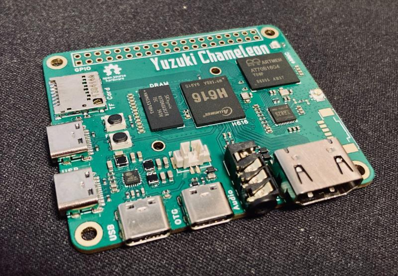
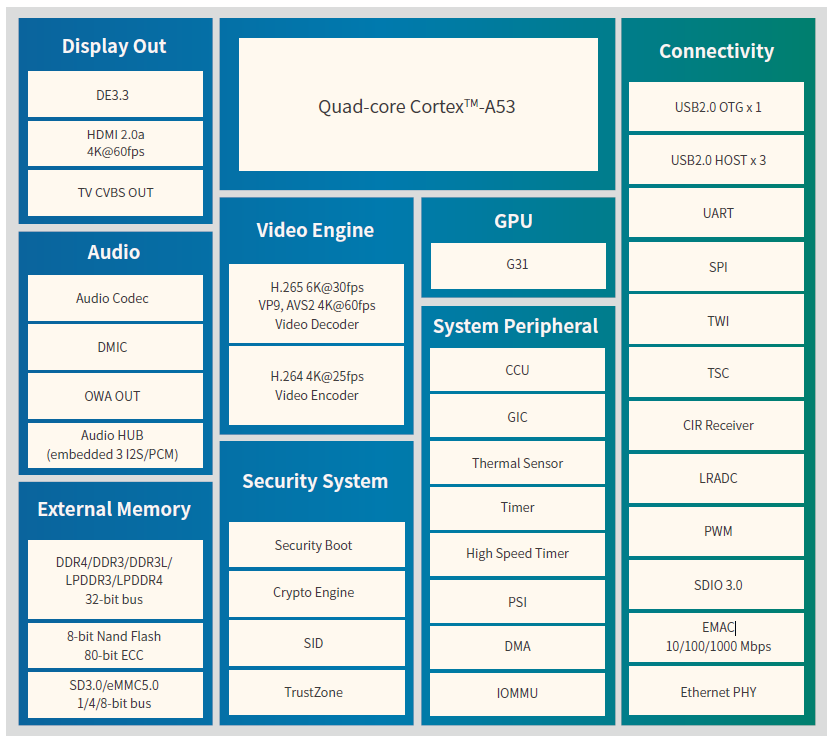
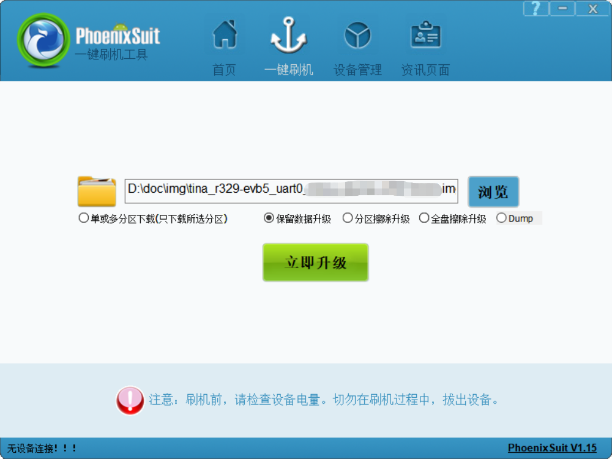

# Yuzuki Chameleon

Yuzuki Chameleon is a Raspberry Pi A Sized SBC based on Allwinner H616

## Feature
- Based on Allwinner H616 chip, 4*Cortex A53
- HDMI supports 4K@60, supports up to 6K video decoding
- Up to 2GB RAM and 128GB eMMC storage
- Onboard eMMC and TF card slot
- Onboard XR829 WIFI+Bluetooth chip
- 4 USB Type C, 3 HOST and one OTG, support USB camera and capture card input
- Onboard fan slot, radiator fixing hole
- Lead out RJ45 100M interface
- Onboard 40 Pin GPIO, can expand SPI LCD display, Gigabit Ethernet, microphone array, CAN transceiver, temperature and humidity sensor, acceleration sensor and so on.
- AXP313A Power Solution
- Raspberry Pi A Size

## Allwinner H616

H616 is a new-generation high picture quality 64-bit 4K@60fps decoding SoC provided by Allwinner for the
OTT and IPTV markets. It integrates the quad core 64-bit CortexTM-A53 processor, and the new G31 GPU
engine of ARM that supports OpenGL ES 3.2/Vulkan 1.1. Besides, H616 supports full-format 4K@60fps
10-bit ultra-HD video decoding, Allwinner self-developed SmartColor3.3TM picture enhancement engine,
Dolby, and DTS audio processing. H616 adopts the new generation of power consumption technology, and
reduces power consumption of 20% than the last generation.

## Firmware

You can find latest firmware at [RELEASE](https://github.com/YuzukiHD/YuzukiChameleon/releases)
We provide Tina Linux, Ubuntu, Android TV firmwares

## Development

Coming soon..

## Flash Firmware

The following mainly introduces the method of flash with PhoenixSuit. The flash method of LiveSuit and PhoenixUSBpro is similar.

Download PhoenixSuit：[PhoenixSuit](https://www.aw-ol.com/downloads/resources/13)

Before using PhoenixSuit, you need to install the driver at the same time: [Allwinner USB Driver](https://www.aw-ol.com/downloads/resources/15)

> Enterprise developers will also install the Allwinner USB driver when installing APST, so there is no need to install it separately

Specific steps are as follows:

1. Open PhoenixSuit, when the device is powered on and connected to the PC, PhoenixSuit will prompt to recognize the device;
2. Click `One-click flash-browse` to select the firmware to be flashed;
3. Click `Upgrade now`, then a restart command will be sent to the device through USB, the device will restart with the programming logo, and enter the flash mode in the restart stage;
4.  When the device returns to boot, it will be automatically programmed, and you can see that the progress bar of PhoenixSuit is moving;
5. After the flash is successful, the device restarts.

If the software cannot automatically connect to the development board, please follow the steps below to force to the download mode:

1. Power on the development board, press and hold the FEL button on the board
2. Click the RST button
3. After the PC is connected to the development board, release the FEL button
4. Just wait for the download

