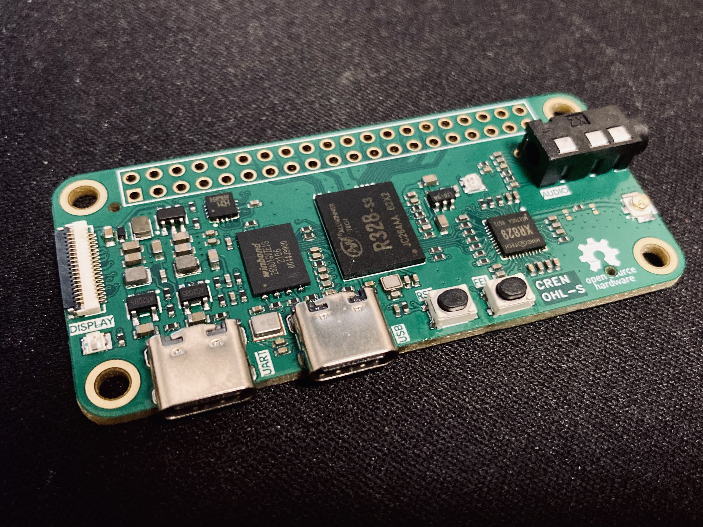
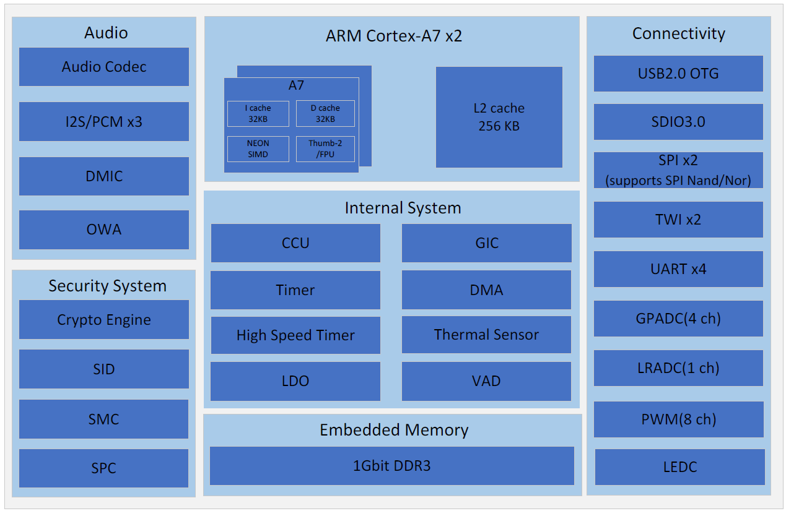

# Yuzuki Rosetta

Yuzuki Rosetta is a low-cost Linux development board based on the R328-S3. Dual-core A7, 128MB RAM, NAND Flash, WI-FI&BT. With Raspberry Pi Zero board shape

- Cortex A7 * 2
- DDR3 128MB
- XR829 Wi-Fi，BT
- MEMS
- Audio Codec & 3.5mm
- RGB LED WS2812
- CH343P UART to USB
- SPI TFT LCD 18Pin

## Allwinner R328

Allwinner’s R328-S3 is a highly integrated dual-core SoC targeted for audio application markets. The R328-S3 integrates a dual-core ARM Cortex-A7 operating up to 1.2GHz. An extensive set of audio interfaces such as audio codec, I2S/PCM,DMIC,one wire audio(OWA) are included for microphone voice wake-up/recognition/record/playback applications on connected audio products. In addition, voice activity detector(VAD) supports low power consumption wake-up function to reduce standby power consumption.

## Development

Coming soon..

## Flash Firmware

The following mainly introduces the method of flash with PhoenixSuit. The flash method of LiveSuit and PhoenixUSBpro is similar.

Download PhoenixSuit：[PhoenixSuit](https://www.aw-ol.com/downloads/resources/13)

Before using PhoenixSuit, you need to install the driver at the same time: [Allwinner USB Driver](https://www.aw-ol.com/downloads/resources/15)

*Enterprise developers will also install the Allwinner USB driver when installing APST, so there is no need to install it separately

Specific steps are as follows:

(1) Open PhoenixSuit, when the device is powered on and connected to the PC, PhoenixSuit will prompt to recognize the device;

(2) Click `One-click flash-browse` to select the firmware to be flashed;

(3) Click `Upgrade now`, then a restart command will be sent to the device through USB, the device will restart with the programming logo, and enter the flash mode in the restart stage;

(4) When the device returns to boot, it will be automatically programmed, and you can see that the progress bar of PhoenixSuit is moving;

(5) After the flash is successful, the device restarts.

